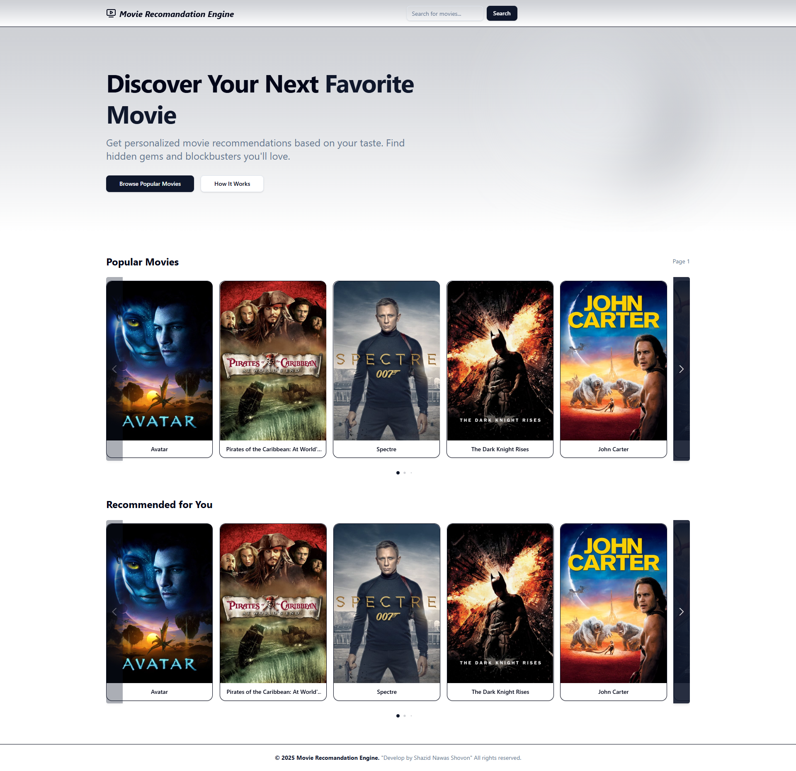
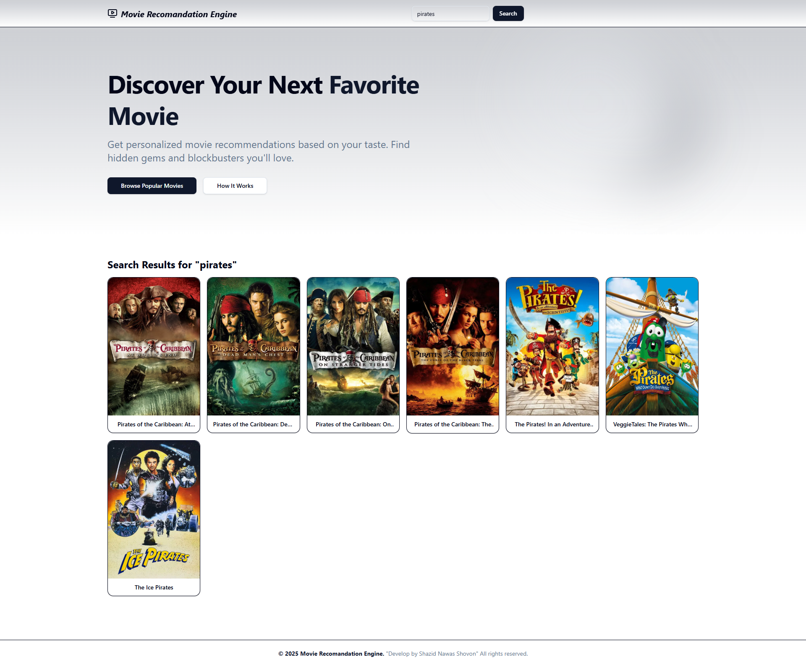
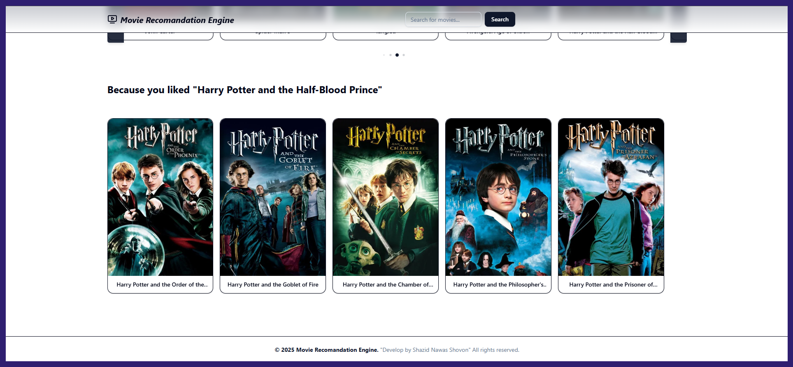

# Movie Recommendation Engine


A modern web application that provides personalized movie recommendations using machine learning techniques. The system combines content-based filtering and collaborative filtering to create a hybrid recommendation system that delivers relevant movie suggestions based on movie content and user preferences.

## Overview

This project implements a full-stack movie recommendation system with a Flask backend API and a React frontend. The recommendation engine uses a hybrid approach that combines:

1. **Content-based filtering**: Recommends movies similar to ones you've liked based on movie features
2. **Collaborative filtering**: Recommends movies that users with similar tastes have enjoyed
3. **Hybrid approach**: Combines both methods for more accurate and diverse recommendations

The application allows users to search for movies, view recommendations based on selected movies, and receive personalized recommendations based on their viewing and rating history.

### Application Screenshots

#### System Overview


#### Search Results


#### Movie Recommendations


## Problem Statement

With thousands of movies available across streaming platforms, users often struggle to find content that matches their preferences. Traditional recommendation systems often suffer from limitations:

- Content-based systems can recommend similar but repetitive content
- Collaborative systems struggle with new users or items (cold start problem)
- Many systems don't adapt to changing user preferences over time

## Solution

This project addresses these challenges through a hybrid recommendation system that:

1. **Combines multiple recommendation approaches**: Uses both content-based and collaborative filtering
2. **Tracks user interactions**: Records views, ratings, and watch history to improve recommendations
3. **Updates dynamically**: Periodically retrains the model to incorporate new user data
4. **Provides a modern UI**: Offers an intuitive interface for discovering movies

### Architecture

#### Backend

- **Flask API**: Provides endpoints for movie search, recommendations, and user interactions
- **Hybrid Recommender**: Combines content-based and collaborative filtering techniques

## Deployment

### Deploying to Render

This project is configured for easy deployment on Render's free tier:

1. Fork or clone this repository to your GitHub account
2. Sign up for a free account at [render.com](https://render.com/)
3. Create a new Web Service and connect your GitHub repository
4. Configure the service with these settings:
   - **Name**: movie-recommender-api (or your preferred name)
   - **Environment**: Python 3
   - **Build Command**: `pip install -r requirements.txt`
   - **Start Command**: `bash render_startup.sh`
   - **Plan**: Free

5. Add the following environment variables:
   - `TMDB_API_KEY`: Your TMDB API key (get one from [themoviedb.org](https://www.themoviedb.org/settings/api))
   - `ALLOWED_ORIGIN`: Your frontend URL (if deploying frontend separately)

The `render_startup.sh` script will automatically:
- Download required datasets if they don't exist
- Train the initial model if needed with memory optimizations
- Start the Flask application with gunicorn using optimized settings

#### Memory Optimization for Render Deployment

This project includes several optimizations to run successfully on Render's free tier (512MB memory limit):

1. **Chunked Processing**: The model training process uses chunked processing for cosine similarity calculations
2. **Memory Management**: Explicit garbage collection and memory cleanup during training
3. **Data Type Optimization**: Using more memory-efficient data types (float32 instead of float64)
4. **Sparse Matrices**: Keeping vectors in sparse format when possible
5. **Gunicorn Configuration**: Optimized settings in gunicorn_config.py for better memory usage

**Note**: Render's free tier has some limitations:
- Services spin down after 15 minutes of inactivity
- Limited to 750 hours of runtime per month
- **User Interaction Tracker**: Records user behavior to improve recommendations
- **Model Updater**: Periodically updates the recommendation model with new data

#### Frontend

- **React**: Modern component-based UI library
- **Vite**: Fast build tool and development server
- **Tailwind CSS**: Utility-first CSS framework for styling
- **ShadcnUI**: Component library for consistent UI elements

## Technical Implementation

### Content-Based Approach

The content-based recommendation system works by:

1. Processing movie metadata (overview, genres, keywords, cast, crew)
2. Creating a feature vector for each movie using TF-IDF
3. Computing similarity between movies using cosine similarity
4. Recommending movies with the highest similarity scores

### Collaborative Filtering

The collaborative filtering component:

1. Builds a user-item interaction matrix based on views, ratings, and watch history
2. Computes user-user similarity using cosine similarity
3. Recommends movies that similar users have enjoyed

### Hybrid Recommender

The hybrid approach combines recommendations from both systems by:

1. Getting recommendations from both content-based and collaborative systems
2. Weighting the recommendations based on confidence factors
3. Merging the results to provide a diverse set of recommendations

## Technologies Used

### Backend

- **Python**: Core programming language
- **Flask**: Web framework for the API
- **Pandas & NumPy**: Data manipulation and numerical computing
- **Scikit-learn**: Machine learning algorithms and utilities
- **NLTK**: Natural language processing for text analysis

### Frontend

- **React**: UI library
- **Vite**: Build tool
- **Tailwind CSS**: Styling
- **ShadcnUI**: Component library
- **Embla Carousel & Swiper**: Carousel components

## Getting Started

### Prerequisites

- Python 3.7+
- Node.js 14+
- npm or yarn

### Installation

1. **Clone the repository**

```bash
git clone https://github.com/ShazidNawasShovon/movie-recommender.git
cd movie-recommender
```

2. **Set up the backend**

```bash
# Create and activate virtual environment
python -m venv .venv
source .venv/bin/activate  # On Windows: .venv\Scripts\activate

# Install dependencies
pip install -r requirements.txt

# Initial model training
python src/scripts/retrain_model.py --initial-train
```

3. **Set up the frontend**

```bash
cd frontend
npm install
```

### Running the Application

1. **Start the backend server**

```bash
# From the project root
python api_server.py
```

2. **Start the frontend development server**

```bash
# From the frontend directory
npm run dev
```

3. **Access the application**

Open your browser and navigate to `http://localhost:5173`

## Project Structure

```
├── api_server.py            # Flask API server
├── artifacts/               # Trained models and data
├── data/                    # Dataset files
│   ├── tmdb_5000_credits.csv
│   ├── tmdb_5000_movies.csv
│   └── user_interactions/   # User interaction data
├── frontend/                # React frontend
│   ├── public/
│   └── src/
│       ├── components/      # React components
│       ├── services/        # API services
│       └── lib/             # Utility functions
└── src/                     # Backend source code
    ├── models/              # Recommendation models
    ├── scripts/             # Utility scripts
    └── utils/               # Helper functions
```

## Features

- **Movie Search**: Search for movies by title
- **Movie Recommendations**: Get recommendations based on a selected movie
- **Personalized Recommendations**: Receive recommendations based on viewing history
- **User Interaction Tracking**: System learns from user behavior
- **Responsive UI**: Works on desktop and mobile devices

## Future Improvements

- User authentication system
- Movie details page with additional information
- Advanced filtering options (by genre, year, rating)
- Watchlist and favorites functionality
- Improved recommendation algorithms with deep learning

## License

This project is licensed under the MIT License - see the LICENSE file for details.

## Acknowledgments

- This product uses the TMDB API but is not endorsed or certified by TMDB
- The dataset used is from [Kaggle TMDB 5000 Movie Dataset](https://www.kaggle.com/tmdb/tmdb-movie-metadata)


